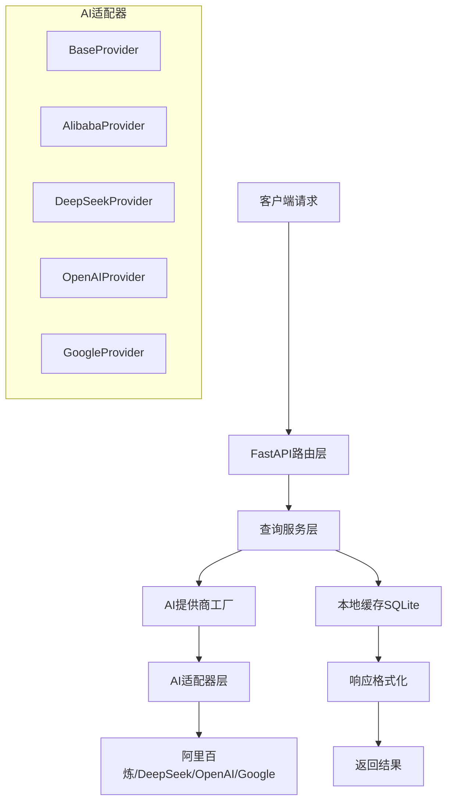

# 🎯 AI智能题库查询系统 v2.0

<div align="center">

[](https://python.org)
[](https://fastapi.tiangolo.com)
[](LICENSE)
[]()
[](https://github.com/blankzsh/AI_OCS_Question_bank)
[](https://github.com/blankzsh/AI_OCS_Question_bank)
[](https://github.com/blankzsh/AI_OCS_Question_bank/issues)

**基于FastAPI的高性能智能题库查询系统，支持多AI平台接口，提供快速准确的题目查询和答案生成服务**

📁 **项目地址**: [https://github.com/blankzsh/AI_OCS_Question_bank](https://github.com/blankzsh/AI_OCS_Question_bank)

[快速开始](#-快速开始) • [API文档](#-api文档) • [配置指南](#-配置说明) • [故障排除](#-故障排除)

</div>

---

## 📋 目录

- [✨ 核心特性](#-核心特性)
- [🏗️ 系统架构](#-系统架构)
- [📋 系统要求](#-系统要求)
- [🚀 快速开始](#-快速开始)
- [📖 API文档](#-api文档)
- [⚙️ 配置说明](#-配置说明)
- [🧪 测试指南](#-测试指南)
- [🔑 API密钥获取](#-api平台获取api密钥)
- [🏗️ 项目结构](#-项目结构)
- [🚨 故障排除](#-故障排除)
- [🤝 贡献指南](#-贡献指南)
- [📄 许可证](#-许可证)

## ✨ 核心特性

### 🚀 **高性能架构**
- **FastAPI异步框架** - 基于现代异步编程，支持高并发
- **SQLite本地缓存** - 智能缓存机制，提升查询效率
- **连接池优化** - 数据库连接复用，降低延迟

### 🤖 **多AI平台集成**
- **阿里百炼** - 通义千问大模型，中文理解能力强
- **DeepSeek** - 高性能代码和理解模型
- **OpenAI** - GPT系列模型，通用性强
- **Google Studio** - Gemini模型，多模态支持

### 🛡️ **企业级特性**
- **类型安全** - Pydantic数据验证，减少运行时错误
- **模块化设计** - 清晰的代码结构，易于维护和扩展
- **统一配置管理** - YAML配置文件，环境隔离
- **自动API文档** - Swagger UI和ReDoc，开发者友好
- **健康检查** - 系统状态监控，便于运维

### 🔧 **开发友好**
- **热重载支持** - 开发环境代码自动重载
- **详细错误信息** - 完善的错误处理和日志
- **单元测试覆盖** - 完整的测试套件
- **RESTful API设计** - 标准化的API接口

## 🏗️ 系统架构



## 📋 系统要求

### 基础环境
- **Python** 3.8+ （推荐 3.9+）
- **pip** 最新版本
- **操作系统** Windows 10+ / macOS 10.14+ / Linux (Ubuntu 18.04+)

### 推荐配置
- **内存** 最低 2GB，推荐 4GB+
- **网络** 稳定的互联网连接（用于AI API调用）
- **存储** 至少 500MB 可用空间

## 🚀 快速开始

### 📦 方式一：完整安装（推荐）

#### 1. 克隆项目
```bash
git clone https://github.com/blankzsh/AI_OCS_Question_bank.git
cd AI_OCS_Question_bank
```

#### 2. 创建虚拟环境
```bash
# Windows
python -m venv venv
venv\Scripts\activate

# macOS/Linux
python3 -m venv venv
source venv/bin/activate
```

#### 3. 安装依赖
```bash
pip install -r requirements.txt
```

#### 4. 配置系统
复制配置模板并编辑：
```bash
cp config.yaml.example config.yaml
```

编辑 `config.yaml` 文件，配置您的AI平台API密钥：

```yaml
# AI平台配置
providers:
  # 阿里百炼配置（默认）
  alibaba:
    name: "阿里百炼"
    enabled: true
    api_key: "your_alibaba_api_key"  # 填入您的API密钥
    base_url: "https://dashscope.aliyuncs.com/compatible-mode/v1"
    model: "qwen-turbo"

  # DeepSeek配置
  deepseek:
    name: "DeepSeek"
    enabled: true
    api_key: "your_deepseek_api_key"  # 填入您的API密钥
    base_url: "https://api.deepseek.com"
    model: "deepseek-chat"

  # OpenAI配置
  openai:
    name: "OpenAI"
    enabled: true
    api_key: "your_openai_api_key"  # 填入您的API密钥
    base_url: "https://api.openai.com/v1"
    model: "gpt-3.5-turbo"

  # Google Studio配置
  google:
    name: "Google Studio"
    enabled: true
    api_key: "your_google_api_key"  # 填入您的API密钥
    base_url: "https://generativelanguage.googleapis.com/v1beta"
    model: "gemini-pro"

# 默认AI平台
ai:
  default_provider: "alibaba"  # 可改为: deepseek, openai, google
```

#### 5. 启动服务
```bash
python main.py
```

### 📦 方式二：Docker部署

```bash
# 构建镜像
docker build -t ai-quiz-system .

# 运行容器
docker run -p 8000:8000 -v $(pwd)/config.yaml:/app/config.yaml ai-quiz-system
```

### 🎯 服务验证

服务启动成功后，您会看到：

```
🎯 AI问答系统 v2.0
==================================================
👤 作者: Toni Wang
📧 邮箱: shell7@petalmail.com
🌐 地址: http://0.0.0.0:8000
==================================================
```

访问 http://localhost:8000 查看API文档

## 📖 API文档

### 🔥 核心接口

#### 智能查询接口

**GET/POST** `/api/query`

智能题目查询和答案生成接口

**GET参数：**
- `title` (必需): 题目内容
- `options` (可选): 选项内容，用空格分隔
- `type` (可选): 题目类型（选择题、填空题、判断题等）

**POST请求体：**
```json
{
  "title": "中国的首都是哪里？",
  "options": ["A.北京", "B.上海", "C.广州"],
  "type": "选择题"
}
```

**请求示例：**
```bash
# GET请求
curl "http://localhost:8000/api/query?title=中国的首都是哪里？&options=A.北京 B.上海 C.广州&type=选择题"

# POST请求
curl -X POST http://localhost:8000/api/query \
  -H "Content-Type: application/json" \
  -d '{
    "title": "1+1等于多少？",
    "type": "填空题"
  }'
```

**成功响应：**
```json
{
  "success": true,
  "data": {
    "code": 1,
    "data": "北京",
    "msg": "AI回答",
    "source": "ai",
    "provider": "alibaba",
    "response_time": 1.23
  },
  "timestamp": "2024-01-01T12:00:00Z"
}
```

**错误响应：**
```json
{
  "success": false,
  "error": {
    "code": 400,
    "message": "缺少必需参数: title",
    "details": "title参数不能为空"
  },
  "timestamp": "2024-01-01T12:00:00Z"
}
```

#### 📊 系统管理接口

| 方法 | 路径 | 描述 | 认证 |
|------|------|------|------|
| `GET` | `/api/health` | 健康检查 | ❌ |
| `GET` | `/api/stats` | 系统统计信息 | ❌ |
| `GET` | `/api/ai-providers` | AI提供商状态 | ❌ |
| `GET` | `/api/system/info` | 系统信息 | ❌ |
| `POST` | `/api/ai/switch/{provider}` | 切换AI提供商 | ❌ |

#### 系统状态检查

**GET** `/api/health`

```json
{
  "status": "healthy",
  "database": "connected",
  "ai_providers": {
    "alibaba": "available",
    "deepseek": "available",
    "openai": "error",
    "google": "available"
  },
  "uptime": "2h 30m 15s",
  "version": "2.0.0"
}
```

#### AI提供商状态

**GET** `/api/ai-providers`

```json
{
  "providers": [
    {
      "name": "alibaba",
      "display_name": "阿里百炼",
      "enabled": true,
      "status": "available",
      "model": "qwen-turbo"
    },
    {
      "name": "deepseek",
      "display_name": "DeepSeek",
      "enabled": true,
      "status": "available",
      "model": "deepseek-chat"
    }
  ],
  "current_provider": "alibaba"
}
```

### 📚 交互式API文档

启动服务后，访问以下地址查看完整API文档：

- **📘 Swagger UI**: http://localhost:8000/docs
  - 支持在线测试API
  - 详细的请求/响应示例
  - 参数说明和约束

- **📗 ReDoc**: http://localhost:8000/redoc
  - 美观的三栏式文档
  - 适合打印和分享
  - 完整的API规范

### 🔄 高级用法

#### 批量查询
```bash
# 使用POST进行批量查询
curl -X POST http://localhost:8000/api/query/batch \
  -H "Content-Type: application/json" \
  -d '{
    "questions": [
      {"title": "1+1=?", "type": "填空题"},
      {"title": "北京是哪个国家的首都？", "type": "选择题"}
    ]
  }'
```

#### 指定AI提供商
```bash
# 临时指定使用的AI平台
curl "http://localhost:8000/api/query?title=编程问题&provider=deepseek"
```

## 🔧 配置说明

### 服务器配置

```yaml
server:
  host: "0.0.0.0"      # 服务器地址
  port: 8000           # 服务器端口
  reload: false        # 是否开启热重载
```

### 数据库配置

```yaml
database:
  url: "sqlite:///./question_bank.db"  # 数据库连接URL
  echo: false                          # 是否打印SQL语句
  pool_size: 5                         # 连接池大小
```

### AI服务配置

```yaml
ai:
  default_provider: "alibaba"  # 默认AI提供商
  timeout: 30                 # 请求超时时间（秒）
  max_retries: 3             # 最大重试次数
  retry_delay: 2             # 重试延迟（秒）
```

## 🧪 测试

### 运行测试

```bash
# 测试API功能
python test_api.py

# 测试应用功能
python test_app.py
```

### 手动测试

```bash
# 测试查询接口
curl "http://localhost:8000/api/query?title=1+1等于多少？&type=填空题"

# 测试健康检查
curl "http://localhost:8000/api/health"

# 测试系统信息
curl "http://localhost:8000/api/system/info"
```

## 🏗️ 项目结构

```
project/
├── app/                         # 应用核心模块
│   ├── __init__.py
│   ├── main.py                  # FastAPI应用主模块
│   ├── config/                  # 配置管理
│   │   ├── __init__.py
│   │   └── settings.py          # 配置加载和验证
│   ├── api/                     # API接口层
│   │   ├── __init__.py
│   │   ├── dependencies.py      # 依赖注入
│   │   └── routes/              # 路由模块
│   │       ├── __init__.py
│   │       └── query.py         # 查询相关路由
│   ├── services/                # 业务服务层
│   │   ├── __init__.py
│   │   └── query_service.py     # 查询业务逻辑
│   ├── models/                  # 数据模型层
│   │   ├── __init__.py
│   │   ├── schemas.py           # Pydantic数据模型
│   │   └── database.py          # 数据库ORM模型
│   └── utils/                   # 工具模块
│       ├── __init__.py
│       └── ai_providers/        # AI提供商适配器
│           ├── __init__.py
│           ├── base.py          # 基础接口
│           ├── factory.py       # 工厂模式
│           ├── alibaba.py       # 阿里百炼适配器
│           ├── deepseek.py      # DeepSeek适配器
│           ├── openai.py        # OpenAI适配器
│           └── google.py        # Google Studio适配器
├── config.yaml                  # 主配置文件
├── main.py                      # 应用启动入口
├── requirements.txt             # 项目依赖
├── README.md                    # 项目说明
├── test_api.py                  # API测试脚本
└── test_app.py                  # 应用测试脚本
```

## 🚨 故障排除

### 常见问题解决

#### 🔧 启动问题

**问题1：端口被占用**
```bash
# 查找占用端口的进程
netstat -ano | findstr :8000  # Windows
lsof -i :8000                  # macOS/Linux

# 杀死进程或修改配置文件中的端口
```

**问题2：依赖安装失败**
```bash
# 升级pip
pip install --upgrade pip

# 使用国内镜像
pip install -r requirements.txt -i https://pypi.tuna.tsinghua.edu.cn/simple/
```

**问题3：虚拟环境激活失败**
```bash
# Windows PowerShell执行策略
Set-ExecutionPolicy -ExecutionPolicy RemoteSigned -Scope CurrentUser

# 或者使用cmd而非PowerShell
```

#### 🔑 API相关问题

**问题1：API密钥无效**
- 确认API密钥复制正确，无空格和换行符
- 检查API密钥是否有效且未过期
- 确认账户余额充足

**问题2：AI平台连接失败**
```bash
# 测试网络连接
curl -I https://dashscope.aliyuncs.com
curl -I https://api.deepseek.com

# 检查防火墙设置
# 确保可以访问对应的AI平台API
```

**问题3：响应超时**
```yaml
# 在config.yaml中增加超时时间
ai:
  timeout: 60        # 增加到60秒
  max_retries: 5     # 增加重试次数
```

#### 🗄️ 数据库问题

**问题1：数据库权限错误**
```bash
# 确保有写入权限
chmod 755 ./
chmod 644 config.yaml
```

**问题2：数据库损坏**
```bash
# 删除数据库文件重新初始化
rm -f question_bank.db
python main.py  # 会自动创建新的数据库
```

#### 📊 性能优化

**内存不足：**
```yaml
# 减小连接池大小
database:
  pool_size: 1
```

**响应缓慢：**
```yaml
# 启用缓存
ai:
  enable_cache: true
  cache_ttl: 3600  # 缓存1小时
```

### 日志调试

#### 启用详细日志
```yaml
# 在config.yaml中添加
logging:
  level: DEBUG
  file: app.log
```

#### 常用调试命令
```bash
# 查看实时日志
tail -f app.log

# 检查系统状态
curl http://localhost:8000/api/health

# 测试AI提供商状态
curl http://localhost:8000/api/ai-providers
```

### 获取帮助

如果遇到其他问题：

1. **查看日志** - 启用DEBUG日志获取详细信息
2. **检查配置** - 确保config.yaml格式正确
3. **测试网络** - 确保可以访问AI平台API
4. **提交Issue** - 在GitHub仓库提交详细问题报告
   - 访问 [Issues页面](https://github.com/blankzsh/AI_OCS_Question_bank/issues)
5. **社区讨论** - 参与项目讨论区获取帮助
   - 访问 [Discussions页面](https://github.com/blankzsh/AI_OCS_Question_bank/discussions)

## 🔑 AI平台获取API密钥

### 阿里百炼 🇨🇳

1. **注册账号**
   - 访问 [阿里云百炼平台](https://bailian.console.aliyun.com/)
   - 使用阿里云账号登录

2. **获取API密钥**
   - 进入控制台 → API-KEY管理
   - 创建新的API Key
   - 复制并妥善保管密钥

3. **费用说明**
   - 新用户有免费额度
   - 按实际使用量计费
   - 支持余额充值

### DeepSeek 🤖

1. **注册账号**
   - 访问 [DeepSeek平台](https://platform.deepseek.com/)
   - 完成邮箱验证和手机绑定

2. **获取API密钥**
   - 点击右上角用户头像 → API Keys
   - 点击"Create new key"
   - 设置Key名称并复制

3. **模型优势**
   - 代码理解能力强
   - 性价比高
   - 支持中文优化

### OpenAI 🌍

1. **注册账号**
   - 访问 [OpenAI平台](https://platform.openai.com/)
   - 需要国外手机号验证

2. **获取API密钥**
   - 进入API Keys页面
   - 点击"Create new secret key"
   - 设置权限和用途限制

3. **注意事项**
   - 需要绑定支付方式
   - 有使用限额
   - 网络访问可能需要代理

### Google Studio 🎯

1. **注册账号**
   - 访问 [Google AI Studio](https://aistudio.google.com/)
   - 使用Google账号登录

2. **获取API密钥**
   - 进入"Get API Key"页面
   - 选择或创建项目
   - 生成API Key

3. **特色功能**
   - 多模态支持
   - Gemini模型强大
   - 免费额度较大

### 🔒 API密钥安全

**重要提醒：**
- ❌ 不要在代码中硬编码API密钥
- ❌ 不要将API密钥提交到版本控制系统
- ❌ 不要在公共场合分享API密钥
- ✅ 使用环境变量或配置文件
- ✅ 定期轮换API密钥
- ✅ 为不同项目使用不同的API密钥

**环境变量方式：**
```bash
# 设置环境变量
export ALIBABA_API_KEY="your_key_here"
export DEEPSEEK_API_KEY="your_key_here"

# 在配置文件中引用
providers:
  alibaba:
    api_key: "${ALIBABA_API_KEY}"
```

## 🤝 贡献指南

### 开发流程

1. **Fork项目**
   - 访问 [https://github.com/blankzsh/AI_OCS_Question_bank](https://github.com/blankzsh/AI_OCS_Question_bank)
   - 点击右上角"Fork"按钮到您的GitHub账户

2. **克隆您的Fork**
   ```bash
   git clone https://github.com/YOUR_USERNAME/AI_OCS_Question_bank.git
   cd AI_OCS_Question_bank
   ```

3. **添加上游仓库**
   ```bash
   git remote add upstream https://github.com/blankzsh/AI_OCS_Question_bank.git
   ```

4. **创建功能分支**
   ```bash
   git checkout -b feature/your-feature-name
   ```

5. **提交更改**
   ```bash
   git commit -m "feat: 添加新功能描述"
   ```

6. **推送到您的Fork**
   ```bash
   git push origin feature/your-feature-name
   ```

7. **创建Pull Request**
   - 在GitHub上创建Pull Request到主仓库

### 代码规范

- **Python代码** 遵循PEP 8规范
- **提交信息** 使用[Conventional Commits](https://www.conventionalcommits.org/)
- **测试覆盖率** 新功能需要包含测试用例
- **文档更新** 重要变更需要更新README

### 问题报告

提交Issue时请包含：

- 📝 **问题描述** - 清晰描述遇到的问题
- 🔄 **重现步骤** - 详细的重现步骤
- 💻 **环境信息** - 操作系统、Python版本等
- 📋 **错误日志** - 相关的错误信息和堆栈跟踪
- 🎯 **期望行为** - 描述您期望的正确行为

## 📄 许可证

本项目采用 **MIT许可证**。

[](https://opensource.org/licenses/MIT)

**简单来说，您可以：**
- ✅ 商业使用
- ✅ 修改和分发
- ✅ 私人使用
- ❗ 需要包含许可证和版权声明
- ❗ 不提供任何担保

## 👨‍💻 作者信息

**Toni Wang**

- 📧 **邮箱**: shell7@petalmail.com
- 🐙 **GitHub**: [https://github.com/blankzsh](https://github.com/blankzsh)
- 💼 **项目仓库**: [https://github.com/blankzsh/AI_OCS_Question_bank](https://github.com/blankzsh/AI_OCS_Question_bank)

---

<div align="center">

## 🌟 感谢使用

如果这个项目对您有帮助，请考虑：

- ⭐ **给个Star** - 让更多人发现这个项目
- 🐛 **报告问题** - 帮助我们改进项目
- 💡 **提出建议** - 分享您的想法和需求
- 📖 **完善文档** - 帮助其他用户

**您的支持是我们持续改进的动力！** 💪

[](https://star-history.com/#blankzsh/AI_OCS_Question_bank&Date)

</div>


