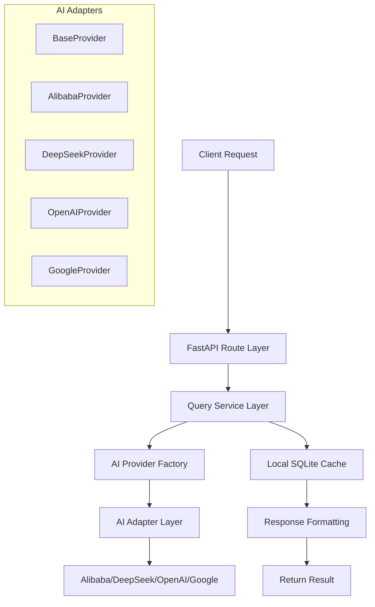

# 🎯 AI Intelligent Quiz System v2.0

<div align="center">

[](https://python.org)
[](https://fastapi.tiangolo.com)
[](LICENSE)
[]()
[](https://github.com/blankzsh/AI_OCS_Question_bank)
[](https://github.com/blankzsh/AI_OCS_Question_bank)
[](https://github.com/blankzsh/AI_OCS_Question_bank/issues)

**A high-performance intelligent quiz system based on FastAPI, supporting multiple AI platform interfaces for fast and accurate quiz queries and answer generation.**

📁 **Project URL**: [https://github.com/blankzsh/AI_OCS_Question_bank](https://github.com/blankzsh/AI_OCS_Question_bank)

[Quick Start](#-quick-start) • [API Documentation](#-api-documentation) • [Configuration Guide](#-configuration-guide) • [Troubleshooting](#-troubleshooting)

</div>

---

## 📋 Table of Contents

- [✨ Core Features](#-core-features)
- [🏗️ System Architecture](#️-system-architecture)
- [📋 System Requirements](#-system-requirements)
- [🚀 Quick Start](#-quick-start)
- [📖 API Documentation](#-api-documentation)
- [⚙️ Configuration Guide](#️-configuration-guide)
- [🧪 Testing Guide](#-testing-guide)
- [🔑 API Key Setup](#-api-platform-api-key-setup)
- [🏗️ Project Structure](#️-project-structure)
- [🚨 Troubleshooting](#-troubleshooting)
- [🤝 Contributing Guidelines](#-contributing-guidelines)
- [📄 License](#-license)

## ✨ Core Features

### 🚀 **High-Performance Architecture**
- **FastAPI Async Framework** - Modern async programming support for high concurrency
- **SQLite Local Cache** - Intelligent caching mechanism for improved query efficiency
- **Connection Pool Optimization** - Database connection reuse for reduced latency

### 🤖 **Multi-AI Platform Integration**
- **Alibaba Bailian** - Qwen large language model with strong Chinese comprehension
- **DeepSeek** - High-performance code and comprehension model
- **OpenAI** - GPT series models with strong general-purpose capabilities
- **Google Studio** - Gemini model with multimodal support

### 🛡️ **Enterprise-Grade Features**
- **Type Safety** - Pydantic data validation to reduce runtime errors
- **Modular Design** - Clean code structure for easy maintenance and extension
- **Unified Configuration Management** - YAML configuration files with environment isolation
- **Auto API Documentation** - Swagger UI and ReDoc for developer-friendly experience
- **Health Checks** - System status monitoring for easy operations

### 🔧 **Developer-Friendly**
- **Hot Reload Support** - Automatic code reloading in development environment
- **Detailed Error Messages** - Comprehensive error handling and logging
- **Unit Test Coverage** - Complete test suite
- **RESTful API Design** - Standardized API interfaces

## 🏗️ System Architecture



## 📋 System Requirements

### Basic Environment
- **Python** 3.8+ (3.9+ recommended)
- **pip** latest version
- **Operating System** Windows 10+ / macOS 10.14+ / Linux (Ubuntu 18.04+)

### Recommended Configuration
- **Memory** Minimum 2GB, Recommended 4GB+
- **Network** Stable internet connection for AI API calls
- **Storage** At least 500MB available space

## 🚀 Quick Start

### 📦 Method 1: Complete Installation (Recommended)

#### 1. Clone the Project
```bash
git clone https://github.com/blankzsh/AI_OCS_Question_bank.git
cd AI_OCS_Question_bank
```

#### 2. Create Virtual Environment
```bash
# Windows
python -m venv venv
venv\Scripts\activate

# macOS/Linux
python3 -m venv venv
source venv/bin/activate
```

#### 3. Install Dependencies
```bash
pip install -r requirements.txt
```

#### 4. Configure System
Copy configuration template and edit:
```bash
cp config.yaml.example config.yaml
```

Edit `config.yaml` file to configure your AI platform API keys:

```yaml
# AI Platform Configuration
providers:
  # Alibaba Bailian Configuration (Default)
  alibaba:
    name: "Alibaba Bailian"
    enabled: true
    api_key: "your_alibaba_api_key"  # Enter your API key
    base_url: "https://dashscope.aliyuncs.com/compatible-mode/v1"
    model: "qwen-turbo"

  # DeepSeek Configuration
  deepseek:
    name: "DeepSeek"
    enabled: true
    api_key: "your_deepseek_api_key"  # Enter your API key
    base_url: "https://api.deepseek.com"
    model: "deepseek-chat"

  # OpenAI Configuration
  openai:
    name: "OpenAI"
    enabled: true
    api_key: "your_openai_api_key"  # Enter your API key
    base_url: "https://api.openai.com/v1"
    model: "gpt-3.5-turbo"

  # Google Studio Configuration
  google:
    name: "Google Studio"
    enabled: true
    api_key: "your_google_api_key"  # Enter your API key
    base_url: "https://generativelanguage.googleapis.com/v1beta"
    model: "gemini-pro"

# Default AI Platform
ai:
  default_provider: "alibaba"  # Can be changed to: deepseek, openai, google
```

#### 5. Start Service
```bash
python main.py
```

### 📦 Method 2: Docker Deployment

```bash
# Build image
docker build -t ai-quiz-system .

# Run container
docker run -p 8000:8000 -v $(pwd)/config.yaml:/app/config.yaml ai-quiz-system
```

### 🎯 Service Verification

After successful startup, you will see:

```
🎯 AI Quiz System v2.0
==================================================
👤 Author: Toni Wang
📧 Email: shell7@petalmail.com
🌐 Address: http://0.0.0.0:8000
==================================================
```

Visit http://localhost:8000 to view API documentation

## 📖 API Documentation

### 🔥 Core Interfaces

#### Intelligent Query Interface

**GET/POST** `/api/query`

Intelligent quiz query and answer generation interface

**GET Parameters:**
- `title` (required): Quiz question content
- `options` (optional): Answer options, separated by spaces
- `type` (optional): Question type (multiple choice, fill-in-the-blank, true/false, etc.)

**POST Request Body:**
```json
{
  "title": "What is the capital of China?",
  "options": ["A. Beijing", "B. Shanghai", "C. Guangzhou"],
  "type": "Multiple Choice"
}
```

**Request Examples:**
```bash
# GET request
curl "http://localhost:8000/api/query?title=What is the capital of China?&options=A. Beijing B. Shanghai C. Guangzhou&type=Multiple Choice"

# POST request
curl -X POST http://localhost:8000/api/query \
  -H "Content-Type: application/json" \
  -d '{
    "title": "What is 1+1?",
    "type": "Fill in the Blank"
  }'
```

**Success Response:**
```json
{
  "success": true,
  "data": {
    "code": 1,
    "data": "Beijing",
    "msg": "AI Response",
    "source": "ai",
    "provider": "alibaba",
    "response_time": 1.23
  },
  "timestamp": "2024-01-01T12:00:00Z"
}
```

**Error Response:**
```json
{
  "success": false,
  "error": {
    "code": 400,
    "message": "Missing required parameter: title",
    "details": "title parameter cannot be empty"
  },
  "timestamp": "2024-01-01T12:00:00Z"
}
```

#### 📊 System Management Interfaces

| Method | Path | Description | Authentication |
|--------|------|-------------|----------------|
| `GET` | `/api/health` | Health check | ❌ |
| `GET` | `/api/stats` | System statistics | ❌ |
| `GET` | `/api/ai-providers` | AI provider status | ❌ |
| `GET` | `/api/system/info` | System information | ❌ |
| `POST` | `/api/ai/switch/{provider}` | Switch AI provider | ❌ |

#### System Health Check

**GET** `/api/health`

```json
{
  "status": "healthy",
  "database": "connected",
  "ai_providers": {
    "alibaba": "available",
    "deepseek": "available",
    "openai": "error",
    "google": "available"
  },
  "uptime": "2h 30m 15s",
  "version": "2.0.0"
}
```

#### AI Provider Status

**GET** `/api/ai-providers`

```json
{
  "providers": [
    {
      "name": "alibaba",
      "display_name": "Alibaba Bailian",
      "enabled": true,
      "status": "available",
      "model": "qwen-turbo"
    },
    {
      "name": "deepseek",
      "display_name": "DeepSeek",
      "enabled": true,
      "status": "available",
      "model": "deepseek-chat"
    }
  ],
  "current_provider": "alibaba"
}
```

### 📚 Interactive API Documentation

After starting the service, visit the following URLs for complete API documentation:

- **📘 Swagger UI**: http://localhost:8000/docs
  - Support for online API testing
  - Detailed request/response examples
  - Parameter descriptions and constraints

- **📗 ReDoc**: http://localhost:8000/redoc
  - Beautiful three-column documentation
  - Suitable for printing and sharing
  - Complete API specifications

### 🔄 Advanced Usage

#### Batch Queries
```bash
# Use POST for batch queries
curl -X POST http://localhost:8000/api/query/batch \
  -H "Content-Type: application/json" \
  -d '{
    "questions": [
      {"title": "1+1=?", "type": "Fill in the Blank"},
      {"title": "Which country is Beijing the capital of?", "type": "Multiple Choice"}
    ]
  }'
```

#### Specify AI Provider
```bash
# Temporarily specify AI platform
curl "http://localhost:8000/api/query?title=Programming question&provider=deepseek"
```

## ⚙️ Configuration Guide

### Server Configuration

```yaml
server:
  host: "0.0.0.0"      # Server address
  port: 8000           # Server port
  reload: false        # Enable hot reload
```

### Database Configuration

```yaml
database:
  url: "sqlite:///./question_bank.db"  # Database connection URL
  echo: false                          # Print SQL statements
  pool_size: 5                         # Connection pool size
```

### AI Service Configuration

```yaml
ai:
  default_provider: "alibaba"  # Default AI provider
  timeout: 30                 # Request timeout (seconds)
  max_retries: 3             # Maximum retry attempts
  retry_delay: 2             # Retry delay (seconds)
```

## 🧪 Testing Guide

### Run Tests

```bash
# Test API functionality
python test_api.py

# Test application functionality
python test_fastapi_app.py
```

### Manual Testing

```bash
# Test query interface
curl "http://localhost:8000/api/query?title=1+1&?type=Fill in the Blank"

# Test health check
curl "http://localhost:8000/api/health"

# Test system information
curl "http://localhost:8000/api/system/info"
```

## 🔑 API Platform API Key Setup

### Alibaba Bailian 🇨🇳

1. **Register Account**
   - Visit [Alibaba Cloud Bailian Platform](https://bailian.console.aliyun.com/)
   - Login with Alibaba Cloud account

2. **Get API Key**
   - Go to Console → API-KEY Management
   - Create new API Key
   - Copy and securely store the key

3. **Pricing**
   - New users have free quota
   - Pay-as-you-go billing
   - Support balance top-up

### DeepSeek 🤖

1. **Register Account**
   - Visit [DeepSeek Platform](https://platform.deepseek.com/)
   - Complete email verification and phone binding

2. **Get API Key**
   - Click user avatar in top right → API Keys
   - Click "Create new key"
   - Set key name and copy

3. **Model Advantages**
   - Strong code comprehension
   - High cost-performance ratio
   - Chinese optimization support

### OpenAI 🌍

1. **Register Account**
   - Visit [OpenAI Platform](https://platform.openai.com/)
   - Requires foreign phone number verification

2. **Get API Key**
   - Go to API Keys page
   - Click "Create new secret key"
   - Set permissions and usage restrictions

3. **Notes**
   - Payment method binding required
   - Usage limits apply
   - Network access may require proxy

### Google Studio 🎯

1. **Register Account**
   - Visit [Google AI Studio](https://aistudio.google.com/)
   - Login with Google account

2. **Get API Key**
   - Go to "Get API Key" page
   - Select or create project
   - Generate API Key

3. **Features**
   - Multimodal support
   - Powerful Gemini model
   - Large free quota

### 🔒 API Key Security

**Important Reminders:**
- ❌ Do not hardcode API keys in code
- ❌ Do not commit API keys to version control
- ❌ Do not share API keys in public
- ✅ Use environment variables or configuration files
- ✅ Rotate API keys regularly
- ✅ Use different API keys for different projects

**Environment Variable Method:**
```bash
# Set environment variables
export ALIBABA_API_KEY="your_key_here"
export DEEPSEEK_API_KEY="your_key_here"

# Reference in configuration file
providers:
  alibaba:
    api_key: "${ALIBABA_API_KEY}"
```

## 🏗️ Project Structure

```
project/
├── app/                         # Core application modules
│   ├── __init__.py
│   ├── main.py                  # FastAPI application main module
│   ├── config/                  # Configuration management
│   │   ├── __init__.py
│   │   └── settings.py          # Configuration loading and validation
│   ├── api/                     # API interface layer
│   │   ├── __init__.py
│   │   ├── dependencies.py      # Dependency injection
│   │   └── routes/              # Route modules
│   │       ├── __init__.py
│   │       └── query.py         # Query-related routes
│   ├── services/                # Business service layer
│   │   ├── __init__.py
│   │   └── query_service.py     # Query business logic
│   ├── models/                  # Data model layer
│   │   ├── __init__.py
│   │   ├── schemas.py           # Pydantic data models
│   │   └── database.py          # Database ORM models
│   └── utils/                   # Utility modules
│       ├── __init__.py
│       └── ai_providers/        # AI provider adapters
│           ├── __init__.py
│           ├── base.py          # Base interface
│           ├── factory.py       # Factory pattern
│           ├── alibaba.py       # Alibaba Bailian adapter
│           ├── deepseek.py      # DeepSeek adapter
│           ├── openai.py        # OpenAI adapter
│           └── google.py        # Google Studio adapter
├── config.yaml                  # Main configuration file
├── main.py                      # Application entry point
├── requirements.txt             # Project dependencies
├── README.md                   # Chinese project documentation
├── README_EN.md                # English project documentation
├── test_api.py                  # API test script
└── test_fastapi_app.py          # Application test script
```

## 🚨 Troubleshooting

### Common Issues and Solutions

#### 🔧 Startup Issues

**Issue 1: Port Already in Use**
```bash
# Find process occupying the port
netstat -ano | findstr :8000  # Windows
lsof -i :8000                  # macOS/Linux

# Kill process or modify port in configuration file
```

**Issue 2: Dependency Installation Failure**
```bash
# Upgrade pip
pip install --upgrade pip

# Use domestic mirror
pip install -r requirements.txt -i https://pypi.tuna.tsinghua.edu.cn/simple/
```

**Issue 3: Virtual Environment Activation Failure**
```bash
# Windows PowerShell execution policy
Set-ExecutionPolicy -ExecutionPolicy RemoteSigned -Scope CurrentUser

# Or use cmd instead of PowerShell
```

#### 🔑 API Related Issues

**Issue 1: Invalid API Key**
- Confirm API key is copied correctly without spaces or newlines
- Check if API key is valid and not expired
- Confirm account balance is sufficient

**Issue 2: AI Platform Connection Failure**
```bash
# Test network connection
curl -I https://dashscope.aliyuncs.com
curl -I https://api.deepseek.com

# Check firewall settings
# Ensure access to corresponding AI platform APIs
```

**Issue 3: Response Timeout**
```yaml
# Increase timeout in config.yaml
ai:
  timeout: 60        # Increase to 60 seconds
  max_retries: 5     # Increase retry attempts
```

#### 🗄️ Database Issues

**Issue 1: Database Permission Error**
```bash
# Ensure write permissions
chmod 755 ./
chmod 644 config.yaml
```

**Issue 2: Database Corruption**
```bash
# Delete database file and reinitialize
rm -f question_bank.db
python main.py  # Will automatically create new database
```

#### 📊 Performance Optimization

**Memory Insufficient:**
```yaml
# Reduce connection pool size
database:
  pool_size: 1
```

**Slow Response:**
```yaml
# Enable caching
ai:
  enable_cache: true
  cache_ttl: 3600  # Cache for 1 hour
```

### Log Debugging

#### Enable Detailed Logging
```yaml
# Add to config.yaml
logging:
  level: DEBUG
  file: app.log
```

#### Common Debugging Commands
```bash
# View real-time logs
tail -f app.log

# Check system status
curl http://localhost:8000/api/health

# Test AI provider status
curl http://localhost:8000/api/ai-providers
```

### Getting Help

If you encounter other issues:

1. **Check Logs** - Enable DEBUG logs for detailed information
2. **Verify Configuration** - Ensure config.yaml format is correct
3. **Test Network** - Ensure access to AI platform APIs
4. **Submit Issue** - Submit detailed problem report in GitHub repository
5. **Community Discussion** - Participate in project discussion area for help

## 🤝 Contributing Guidelines

### Development Workflow

1. **Fork Project** to your GitHub account
2. **Create Feature Branch**
   ```bash
   git checkout -b feature/your-feature-name
   ```
3. **Commit Changes**
   ```bash
   git commit -m "feat: add new feature description"
   ```
4. **Push to Your Fork**
   ```bash
   git push origin feature/your-feature-name
   ```
5. **Create Pull Request**

### Code Standards

- **Python Code** Follow PEP 8 standards
- **Commit Messages** Use [Conventional Commits](https://www.conventionalcommits.org/)
- **Test Coverage** New features need to include test cases
- **Documentation Updates** Important changes need README updates

### Issue Reporting

Please include when submitting issues:

- 📝 **Problem Description** - Clear description of the issue
- 🔄 **Reproduction Steps** - Detailed reproduction steps
- 💻 **Environment Info** - Operating system, Python version, etc.
- 📋 **Error Logs** - Related error messages and stack traces
- 🎯 **Expected Behavior** - Describe expected correct behavior

## 📄 License

This project uses **MIT License**.

[](https://opensource.org/licenses/MIT)

**In simple terms, you can:**
- ✅ Commercial use
- ✅ Modify and distribute
- ✅ Private use
- ❗ Need to include license and copyright notices
- ❗ No warranty provided

## 👨‍💻 Author Information

**Toni Wang**

- 📧 **Email**: shell7@petalmail.com
- 🐙 **GitHub**: [https://github.com/blankzsh](https://github.com/blankzsh)
- 💼 **Project Repository**: [https://github.com/blankzsh/AI_OCS_Question_bank](https://github.com/blankzsh/AI_OCS_Question_bank)

---

<div align="center">

## 🌟 Thank You for Using

If this project helps you, please consider:

- ⭐ **Give a Star** - Help more people discover this project
- 🐛 **Report Issues** - Help us improve the project
- 💡 **Provide Suggestions** - Share your thoughts and needs
- 📖 **Improve Documentation** - Help other users

**Your support drives our continuous improvement!** 💪

[](https://star-history.com/#blankzsh/AI_OCS_Question_bank&Date)

</div>